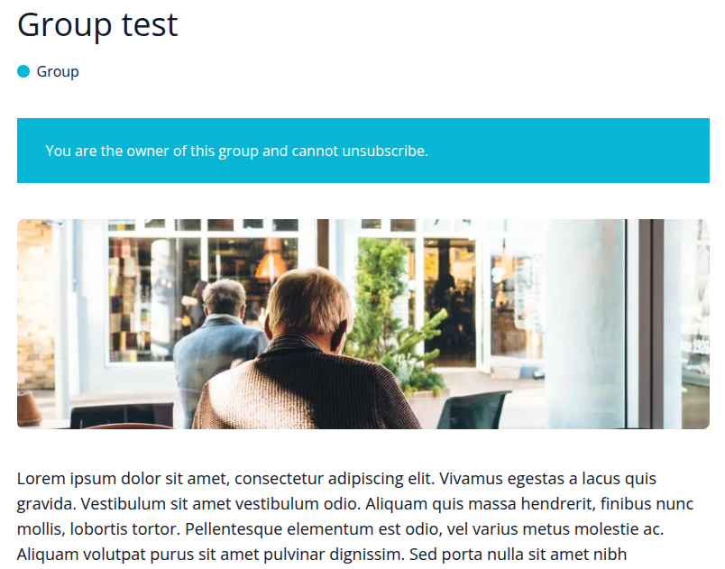
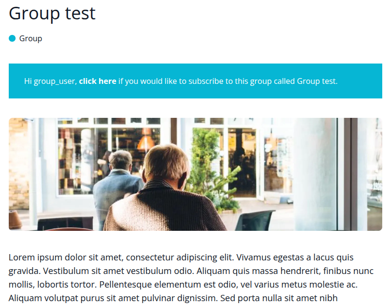
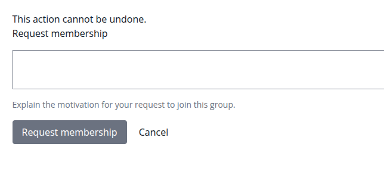
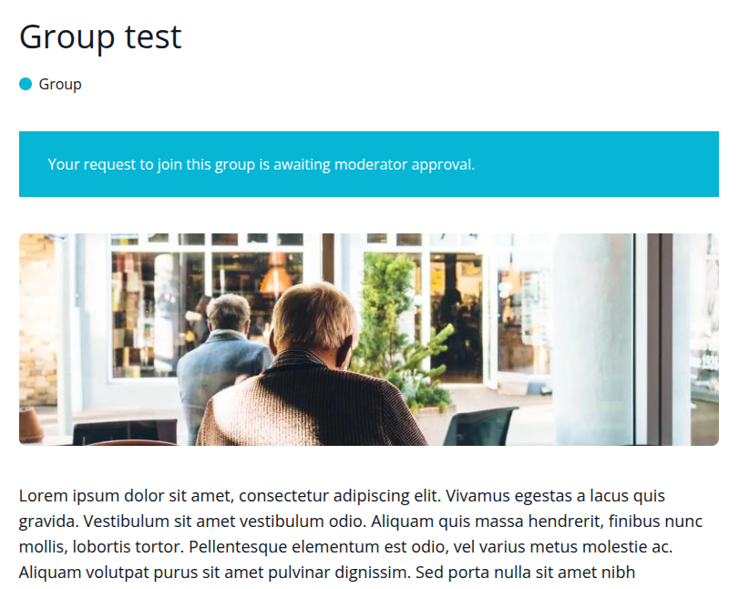
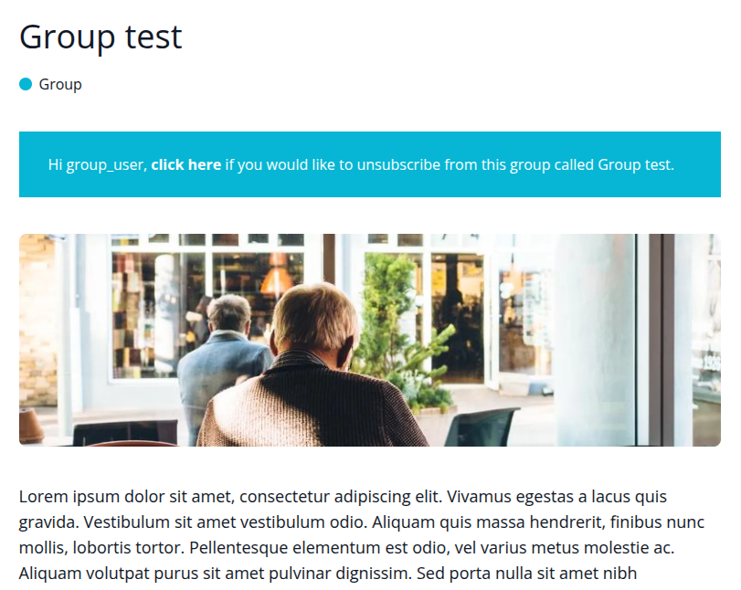

# Module server_og

### Description
Provide creation a new content type "Group" with pre-existing fields for Image (field_featured_image) and Body (field_body) via install script.

I do not use configs and post_update scripts:
- In case with configs OG 2.0 doesn't support correct marking node type as a group type.
- In case with post_update (for example, we can create a content type via configs and update internal settings via script, but it will ask to run updb).

### Media

1. Owner


2. Subscribe


3. Request form


4. Pending


5. Unsubscribe


### Scheme
```
server_og/
└── content/
  └── node/
    └── 6ac43b8e-771c-4f28-9bcf-d1daa497f329.yml
  └── user/
    └── 0f1e36b7-51b1-4c7c-8c95-8a4b998b4295.yml
├── src
  └── Plugin
    └── EntityViewBuilder
      └── NodeGroup.php
    └── ThemeTrait
      └── ElementNodeGroupThemeTrait.php
    └── Util
      └── Install.php
├── tests
  └── src/
    └── ServerGeneralNodeGroupTest.php
├── README.md
├── server_og.info.yml
└── server_og.install
```

Based on
- ElementLayoutThemeTrait (trait)
- InnerElementLayoutThemeTrait (trait)
- SocialShareThemeTrait (trait)
- TitleAndLabelsThemeTrait (trait)
- NodeGroup (plugin, "node.group").

I didn't move internal logic of message/link definitions to separated service or trait.
Cache checking was added as well.

*(Honestly, I was surprised that basic messenger servise doesn't work correctly/expected - I did add own message output).*

### Tests

Based on ServerGeneralNodeTestBase (server_general).
Provide 5 tests:
 - testNodeAvailable: Check node available
 - testNodeAvailableForOwner: Check node available for owner
 - testNodeAvailableForNotOwner: Check node available for not owner
 - testNodeAvailableToSubscribe: Check node available to subscribe
 - testNodeAvailableToUnsubscribe: Check node available to unsubscribe

How to run?
```
ddev phpunit web/modules/custom/server_og/tests/src/ServerGeneralNodeGroupTest.php
```

### Install
Dependencies:
- og:og
- og:og_ui
- default_content:default_content
- server_general:server_general

Install this module using the standard Drupal module installation process.
Supports D9/D10.

After module install you can open node/12 for tests (for clean installation).

For message styling markup used basic tailwind css.


